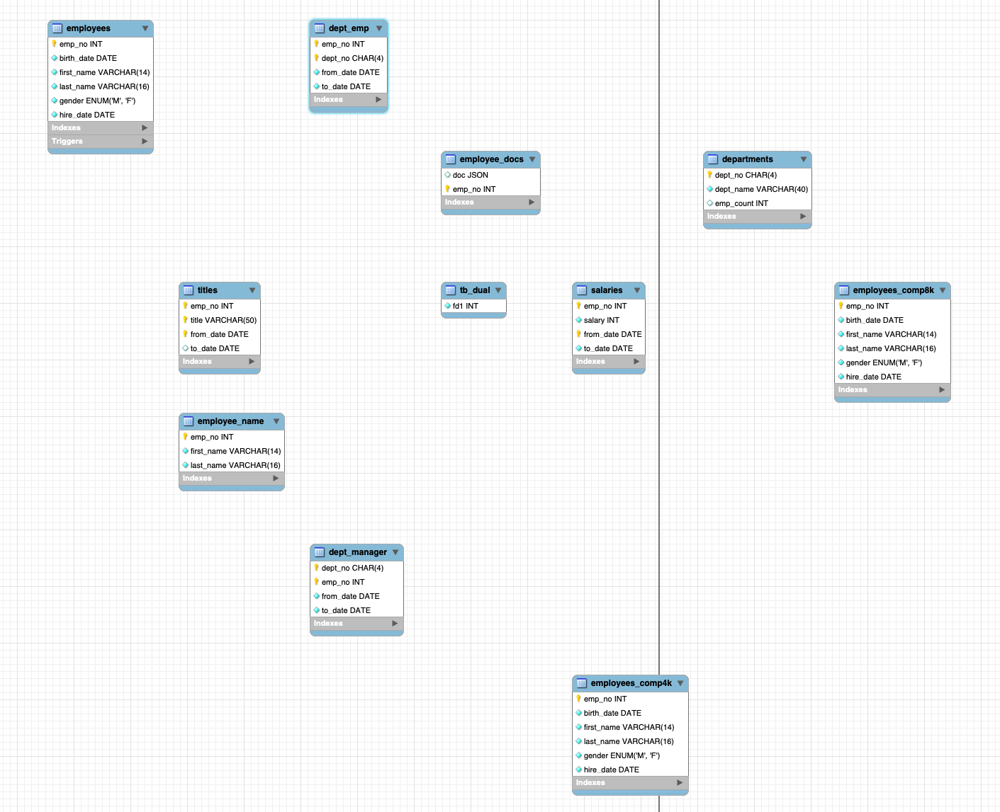

<div align="center">

# Deep Dive  
Deep Dive into Real MySQL 8.0(2)

--- 
</div>

## Contents
- [들어가며](#들어가며)
- [Sysbench](#sysbench)
- [Employees](#employees)
- [쿼리 최적화 1 - 단일 테이블, 단일 레코드 조회](#쿼리-최적화-1---단일-테이블-단일-레코드-조회)
- [쿼리 최적화 2 - 단일 테이블의 범위 검색](#쿼리-최적화-2---단일-테이블의-범위-검색)
- [쿼리 최적화 3 - 다중 테이블의 JOIN, 복합 인덱스](#쿼리-최적화-3---다중-테이블의-join-복합-인덱스)
---
## 들어가며
Real My SQL 8.0 2권의 쿼리 성능 테스트 부분을 공부하며 실제 db 성능 테스트는 어떻게 이루어지는지 오픈소스 [Sysbench](https://github.com/akopytov/sysbench)를 활용하여 테스트 해보고자 한다.

## Sysbench
sysbench는 DB 성능 측정을 중심으로 CPU, 메모리, 파일ㅡ 쓰레드까지 다양하게 테스트할 수 있는 벤치마크 도구이다. LuaJIT기반으로 lua 스크립트를 작성하여 쿼리들을 테스트할 수 있는 오픈소스라서 이를 통해 세 가지의 경우의 쿼리를 작성하고 최적화 하는 단계를 거쳐보려고 한다.

## Employees
데이터 샘플로는 책에서 제공하는 Employees 데이터베이스를 사용할 예정이다. 


## 쿼리 최적화 1 - 단일 테이블, 단일 레코드 조회
먼저 단일 테이블에서 단일 레코드를 조회할건데 280만건이 있는 salaries 테이블에서 일치하는 단일 레코드(63663)를 조회하는 쿼리를 작성해보면 다음과 같다.

```sql
SELECT *
FROM salaries
WHERE salary = 63663
```
이를 Sysbench에서 테스트하기 위한 lua script로 옮기면 아래와 같아서 같은 디렉토리에서 실행만 해주면 된다. 

```lua
function thread_init()
    drv = sysbench.sql.driver()
    con = drv:connect()
end

function event()

    con:query(string.format(
        "SELECT * FROM salaries WHERE salary = 63663",
    ))
end

function thread_done()
    con:disconnect()
end
```

이를 실행하기 전에 실행 계획을 살펴보자 인덱스를 아무것도 설정해두지 않았기 때문에 280만건이 모두 풀 스캔 되는 상황이다.
```sql
+----+-------------+----------+------------+------+---------------+------+---------+------+---------+----------+-------------+
| id | select_type | table    | partitions | type | possible_keys | key  | key_len | ref  | rows    | filtered | Extra       |
+----+-------------+----------+------------+------+---------------+------+---------+------+---------+----------+-------------+
|  1 | SIMPLE      | salaries | NULL       | ALL  | NULL          | NULL | NULL    | NULL | 2838426 |    10.00 | Using where |
+----+-------------+----------+------------+------+---------------+------+---------+------+---------+----------+-------------+
```

테스트 쓰레드 수는 4개로 임의로 설정하였고 시간은 10초로 설정한다.

```
apple@appleui-MacBookPro-2 Desktop % sysbench test.lua \
  --mysql-host=localhost \
  --mysql-user=root \
  --mysql-db=employees \
  --threads=4 \
  --time=10 \
  run
```

```sql
sysbench 1.0.20 (using system LuaJIT 2.1.1727870382)

Running the test with following options:
Number of threads: 4
Initializing random number generator from current time


Initializing worker threads...

Threads started!

SQL statistics:
    queries performed:
        read:                            136
        write:                           0
        other:                           0
        total:                           136
    transactions:                        136    (13.44 per sec.)
    queries:                             136    (13.44 per sec.)
    ignored errors:                      0      (0.00 per sec.)
    reconnects:                          0      (0.00 per sec.)

General statistics:
    total time:                          10.1197s
    total number of events:              136

Latency (ms):
         min:                                  291.75
         avg:                                  297.53
         max:                                  444.60
         95th percentile:                        0.00
         sum:                                40463.79

Threads fairness:
    events (avg/stddev):           34.0000/0.00
    execution time (avg/stddev):   10.1159/0.00
```
latency 부분을 주목해서 확인하면 되는데 sysbench 평균 latency는 297ms에 가깝다. 캐시와 여타의 변수를 확인 해야하지만 이를 명확하게 줄일 수 있다면 그러한 변수들은 문제가 되지 않을 것이다.

그럼 salaries에 salaries 칼럼에 인덱스를 걸고 테스트를 해보자.

```sql
CREATE INDEX idx_salary ON salaries(salary);
```

```sql
+----+-------------+----------+------------+------+---------------+------------+---------+-------+------+----------+-------+
| id | select_type | table    | partitions | type | possible_keys | key        | key_len | ref   | rows | filtered | Extra |
+----+-------------+----------+------------+------+---------------+------------+---------+-------+------+----------+-------+
|  1 | SIMPLE      | salaries | NULL       | ref  | idx_salary    | idx_salary | 4       | const |   55 |   100.00 | NULL  |
+----+-------------+----------+------------+------+---------------+------------+---------+-------+------+----------+-------+
```

```sql
sysbench 1.0.20 (using system LuaJIT 2.1.1727870382)

Running the test with following options:
Number of threads: 4
Initializing random number generator from current time


Initializing worker threads...

Threads started!

SQL statistics:
    queries performed:
        read:                            322386
        write:                           0
        other:                           0
        total:                           322386
    transactions:                        322386 (32235.99 per sec.)
    queries:                             322386 (32235.99 per sec.)
    ignored errors:                      0      (0.00 per sec.)
    reconnects:                          0      (0.00 per sec.)

General statistics:
    total time:                          10.0006s
    total number of events:              322386

Latency (ms):
         min:                                    0.06
         avg:                                    0.12
         max:                                    9.59
         95th percentile:                        0.00
         sum:                                39969.86

Threads fairness:
    events (avg/stddev):           80596.5000/27.55
    execution time (avg/stddev):   9.9925/0.00

```
쿼리의 실행 계획과 sysbench 결과에서도 확인할 수 있는 것처럼 눈에 평균 latency는 297ms 에서 0.12ms로 확연히 줄었다.


## 쿼리 최적화 2 - 단일 테이블의 범위 검색

그렇다면 범위를 검색하는 경우에도 최적화가 가능할 지 확인해보자

employee 중에 입사일이 1999년도인 사람들을 조회하는 쿼리를 아래 lua script로 조회해보자
```lua
function thread_init()
    drv = sysbench.sql.driver()
    con = drv:connect()
end

function event()
    con:query("SELECT * FROM employees WHERE hire_date BETWEEN '1999-01-01' AND '1999-12-31'")
end

function thread_done()
    con:disconnect()
end
```

```sql
sysbench 1.0.20 (using system LuaJIT 2.1.1727870382)

Running the test with following options:
Number of threads: 4
Initializing random number generator from current time


Initializing worker threads...

Threads started!

SQL statistics:
    queries performed:
        read:                            463
        write:                           0
        other:                           0
        total:                           463
    transactions:                        463    (45.94 per sec.)
    queries:                             463    (45.94 per sec.)
    ignored errors:                      0      (0.00 per sec.)
    reconnects:                          0      (0.00 per sec.)

General statistics:
    total time:                          10.0763s
    total number of events:              463

Latency (ms):
         min:                                   83.64
         avg:                                   86.84
         max:                                  168.44
         95th percentile:                        0.00
         sum:                                40205.86

Threads fairness:
    events (avg/stddev):           115.7500/0.43
    execution time (avg/stddev):   10.0515/0.03

```

여기서도 hire_date에 인덱스를 걸어서 결과를 확인해보면 

```sql
CREATE INDEX idx_hire_date ON employees(hire_date);
```


```sql
sysbench 1.0.20 (using system LuaJIT 2.1.1727870382)

Running the test with following options:
Number of threads: 4
Initializing random number generator from current time


Initializing worker threads...

Threads started!

SQL statistics:
    queries performed:
        read:                            20536
        write:                           0
        other:                           0
        total:                           20536
    transactions:                        20536  (2053.14 per sec.)
    queries:                             20536  (2053.14 per sec.)
    ignored errors:                      0      (0.00 per sec.)
    reconnects:                          0      (0.00 per sec.)

General statistics:
    total time:                          10.0020s
    total number of events:              20536

Latency (ms):
         min:                                    1.66
         avg:                                    1.95
         max:                                   13.19
         95th percentile:                        0.00
         sum:                                40002.95

Threads fairness:
    events (avg/stddev):           5134.0000/0.71
    execution time (avg/stddev):   10.0007/0.00
```
평균 latency가 86.84ms에서 1.95ms로 눈에 띄게 줄어들었다.


## 쿼리 최적화 3 - 다중 테이블의 JOIN, 복합 인덱스
그렇다면 단일 테이블 말고 다중 테이블을 JOIN하는 경우에 복합인덱스를 걸었을 때 영향이 있는지 확인해보자.

employees에서 직급이 Senior Staff이고 현재까지 다니고 있는 사람을 조회하는 쿼리를 옮겨보면 아래와 같다.

```sql
function thread_init()
    drv = sysbench.sql.driver()
    con = drv:connect()
end

function event()
    con:query("SELECT e.emp_no, e.first_name, e.last_name, t.title FROM employees e JOIN titles t ON e.emp_no = t.emp_no WHERE t.title = 'Senior Staff' AND t.to_date = '9999-01-01'")
end

function thread_done()
    con:disconnect()
end
```

```sql
sysbench 1.0.20 (using system LuaJIT 2.1.1727870382)

Running the test with following options:
Number of threads: 4
Initializing random number generator from current time


Initializing worker threads...

Threads started!

SQL statistics:
    queries performed:
        read:                            460
        write:                           0
        other:                           0
        total:                           460
    transactions:                        460    (45.75 per sec.)
    queries:                             460    (45.75 per sec.)
    ignored errors:                      0      (0.00 per sec.)
    reconnects:                          0      (0.00 per sec.)

General statistics:
    total time:                          10.0544s
    total number of events:              460

Latency (ms):
         min:                                   78.60
         avg:                                   87.14
         max:                                  143.53
         95th percentile:                        0.00
         sum:                                40083.75

Threads fairness:
    events (avg/stddev):           115.0000/0.00
    execution time (avg/stddev):   10.0209/0.02

```

이 경우에는 title과 to_date 칼럼에 복합 인덱스를 걸어주면 되는데 

```sql
CREATE INDEX idx_title_todate ON titles(title, to_date);
```

```sql
sysbench 1.0.20 (using system LuaJIT 2.1.1727870382)

Running the test with following options:
Number of threads: 4
Initializing random number generator from current time


Initializing worker threads...

Threads started!

SQL statistics:
    queries performed:
        read:                            605
        write:                           0
        other:                           0
        total:                           605
    transactions:                        605    (60.25 per sec.)
    queries:                             605    (60.25 per sec.)
    ignored errors:                      0      (0.00 per sec.)
    reconnects:                          0      (0.00 per sec.)

General statistics:
    total time:                          10.0417s
    total number of events:              605

Latency (ms):
         min:                                   61.05
         avg:                                   66.28
         max:                                  114.14
         95th percentile:                        0.00
         sum:                                40099.73

Threads fairness:
    events (avg/stddev):           151.2500/0.43
    execution time (avg/stddev):   10.0249/0.01


```

결과를 보면 약 87ms에서 66ms까지 단축했음을 보여준다. 효과가 다른 경우들 보다는 높지 않은 것을 확인할 수 있는데 이는 결과의 행의 수가 다른 조회 건수들에 비해 많아서 그다지 효과가 높지 않기 떄문이다.
